# Certificate in Quantitative Finance

## Final Project

  


### Algorithmic Trading for Reversion and Trend-Following

  
  
  
  
  


  

#### Edoardo Bonacina

  

**************************************************************************

# Table of Contents

## Part I: Strategy Implementation and Analysis
1. Introduction
   - Market Context 
   - Data Collection and Preparation

2. Strategy Development
   - Moving Average Crossover Implementation
   - Bollinger Bands Implementation
   - Mathematical Foundations

3. Performance Analysis
   - Strategy Evaluation Metrics
   - Optimization Framework
   - Results Visualization

## Part II: Live Trading Infrastructure 
1. Broker API Integration
   - REST API Implementation
   - WebSocket Configuration
   - Market Data Processing
   - Order Management

2. System Architecture
   - Core Components
   - Data Pipeline
   - Market State Management
   - Position Tracking

## Part III: Risk Management & System Testing
1. Event Handling and Verification
   - Server Response Validation
   - Position Verification
   - Data Quality Checks

2. Risk Monitoring
   - Real-time Metrics
   - Performance Tracking
   - Capital Preservation
   - Market Impact Analysis

3. Error Handling
   - Position Verification
   - Market Data Validation
   - Order Execution 
   - WebSocket Management
   - System Shutdown

## Deep Dive: Main Trading Loop
1. Strategy Implementation Details
   - Price Window Management
   - Signal Generation
   - Risk Integration
   - Performance Monitoring

2. Potential Improvements
   - Transaction Cost Optimization
   - Position Size Management
   - Market Impact Analysis
   - Future Enhancements

## Conclusion
- Requirements Coverage
- System Capabilities
- Further Development

**************************************************************************

# Algorithmic Trading System Implementation

  

This report presents a comprehensive implementation of algorithmic trading strategies with a focus on high-frequency execution, fulfilling the requirements outlined in the assignment. The implementation consists of three major parts as predisposed by the assignment.

The implementation is provided in both Python (for backtesting and analysis in Part 1) and Rust (for live trading for Part 2 and 3), showcasing: Performance optimization for HFT applications, memory safety and thread security error handling and comprehensive logging and monitoring.

Each component has been designed with modularity in mind, allowing for easy modification of strategies, risk parameters, and execution logic. The system has been tested extensively in both simulated and live environments, with particular attention paid to handling edge cases and market anomalies.

The following sections provide detailed documentation of each component, including mathematical foundations, implementation details, and performance analysis.

**************************************************************************


# Part I -- Implementation and Performance Analysis of Trend-Following and Mean Reversion Strategies for BTC/USD

### Introduction

This analysis implements and evaluates two distinct algorithmic trading strategies—Moving Average Crossover (trend-following) and Bollinger Bands (mean reversion)—applied to the BTC/USDT market. The analysis covers various timeframes (1-minute, 5-minute, and 15-minute) and includes extensive parameter optimization to identify the most effective configurations for each strategy. In total ther are 16 MA strategies and 20 Bollinger Band strategies per dataset (1, 5, 15 min). This provides a broad enough sope of parameters to determine roughly in what environments thes strategies perform the best. Given running this code takes upwards of 5hrs time constraints have limited the exploraiton across an even broader set of parameters.

This part of the code will cover part 1 of the assignment. 

Initially I will outline the data collection and preparation stage.

I will move on to describe the signal generation algorithm and the optimizaton parameters including performance and risk metrics.

I will then create visualization and plot the returns, and trading signals of the strategy versus the underlying asset. The backtest will be executed feeding the data sequentially thus simulaitng a real trading environment.

Finally I will compare all the best strategies per dataset and provide more colour and possible explanations for the results we see.

### 1. Introduction and Market Context

The cryptocurrency market, particularly BTC/USDT, presents unique challenges and opportunities for algorithmic trading. Bitcoin's high volatility and 24/7 trading environment make it an ideal candidate for automated trading strategies. During the testing period (January-December 2024), the market exhibited significant volatility and directional movements, providing opportunities for both trend-following and mean reversion approaches. To be in line with the characteristics of the crypto market, trading days have been adjusted to account for 365 days of trading.

## Data gathering

Data is collected using Binance API endpoints that cover that require private API Keys to query the data. These were acquired by simply opening a Binance account and generating the necessary keys from the UI.

In the cell below we query 1-minute candle data for the period 1 January 2024 to 1 December 2024. This period was chosen as over the year the cryptocurrency market experienced siginicant down and upswings as well as several unpredictable events that put to the test both strategies implemented at different points.

The 1- minute candle data is also resampled to generate different datasets that will be later used to measure the impact that noise can have on either strategy. The data is resmpled to 5 and 15 minute candles.


```python
import pandas as pd
import numpy as np
import matplotlib.pyplot as plt
import seaborn as sns
from binance.client import Client
from datetime import datetime, timedelta
import os
```


```python
# Configure seaborn style 
sns.set_style("darkgrid")  # Use darkgrid style from seaborn
sns.set_context("notebook")  # Set context for better visibility
sns.set_palette("husl")  # Set color palette

# Initialize Binance client 
client = Client(
    os.getenv("BINANCE_API_KEY", "key"),
    os.getenv("BINANCE_API_SECRET", "secret")
)

def fetch_historical_data(symbol: str, interval: str, start_date: str, end_date: str = None) -> pd.DataFrame:
    """Fetch historical price data from Binance"""
    # Get historical klines
    klines = client.get_historical_klines(
        symbol=symbol,
        interval=interval,
        start_str=start_date,
        end_str=end_date
    )
    
    # Create DataFrame
    df = pd.DataFrame(klines, columns=[
        'timestamp', 'open', 'high', 'low', 'close', 'volume',
        'close_time', 'quote_volume', 'trades', 'taker_base',
        'taker_quote', 'ignored'
    ])
    
    # Convert timestamp to datetime
    df['timestamp'] = pd.to_datetime(df['timestamp'], unit='ms')
    df.set_index('timestamp', inplace=True)
    
    # Convert string columns to float
    numeric_columns = ['open', 'high', 'low', 'close', 'volume']
    df[numeric_columns] = df[numeric_columns].astype(float)
    
    return df[numeric_columns]

# Fetch data for different timeframes
symbol = "BTCUSDT"
start_date = "1 Jan, 2024"
end_date = "1 Dec, 2024"

# Fetch 1-minute data and create different timeframes
df_1m = fetch_historical_data(symbol, Client.KLINE_INTERVAL_1MINUTE, start_date, end_date)
df_5m = df_1m.resample('5min').agg({
    'open': 'first',
    'high': 'max',
    'low': 'min',
    'close': 'last',
    'volume': 'sum'
}).dropna()

df_15m = df_1m.resample('15min').agg({
    'open': 'first',
    'high': 'max',
    'low': 'min',
    'close': 'last',
    'volume': 'sum'
}).dropna()

print("Data shapes:")
print(f"1-minute: {df_1m.shape}")
print(f"5-minute: {df_5m.shape}")
print(f"15-minute: {df_15m.shape}")
```

    Data shapes:
    1-minute: (482401, 5)
    5-minute: (96481, 5)
    15-minute: (32161, 5)
    

# Trend-Following Strategy: Moving Average Crossover

## Overview

This section of the report details the implementation of a trend-following strategy using Exponential Moving Average (EMA) crossovers, enhanced with volume filtering and risk management components. The strategy is designed to capture sustained price movements while incorporating practical trading considerations such as transaction costs and market liquidity.

## Mathematical Foundation

The core of our trend-following strategy relies on Exponential Moving Averages, which give more weight to recent prices compared to simple moving averages. The EMA is calculated recursively as:

$$EMA_t = \alpha P_t + (1-\alpha)EMA_{t-1}$$

where $\alpha = \frac{2}{n+1}$, $n$ is the period length, and $P_t$ represents the price at time $t$. We utilize two EMAs:
- A shorter-period EMA to capture recent price movements
- A longer-period EMA to establish the broader trend

The strategy generates trading signals based on the relative positions of these averages, with buy signals occurring when the short-term EMA crosses above the long-term EMA, and sell signals when it crosses below.

## Volume Confirmation

To enhance signal quality, we incorporate volume analysis through a simple but effective filter:

$$VMA_t = \frac{1}{20}\sum_{i=t-19}^t V_i$$

A trade signal is only valid when the current volume exceeds this 20-period moving average, ensuring that trend movements are supported by sufficient trading activity.

## Risk Management Framework

The implementation includes several risk management components:

1. Stop-Loss Mechanism:
   $$StopLoss = \begin{cases} 
   -1 & \text{if } \frac{P_t - P_{entry}}{P_{entry}} < -SL_{pct} \\
   1 & \text{if } \frac{P_t - P_{entry}}{P_{entry}} > SL_{pct} \\
   0 & \text{otherwise}
   \end{cases}$$

2. Transaction Cost Management:
   $$MinMove_t = P_t \times (2 \times FeeRate)$$

This ensures that trades are only executed when the potential profit exceeds the round-trip transaction costs.

## Trading Signal Generation

The complete trading signal is determined by:

$$Signal_t = \begin{cases} 
1 & \text{if } EMA_{short} > EMA_{long} \text{ and } V_t > VMA_t \\
-1 & \text{if } EMA_{short} < EMA_{long} \text{ and } V_t > VMA_t \\
0 & \text{otherwise}
\end{cases}$$

## Parameter Optimization

The strategy implementation includes a comprehensive optimization framework that tests various combinations of:
- Short-term EMA periods (5, 10, 20, 30 candles)
- Long-term EMA periods (50, 100, 150, 200 candles)

These parameters are evaluated based on multiple performance metrics including:
- Sharpe Ratio
- Total Return
- Maximum Drawdown
- Win Rate
- Profit Factor

## Strategy Enhancements

Several enhancements have been implemented beyond the basic moving average crossover system:

1. Dynamic Position Sizing: Positions are sized based on available capital and risk parameters.
2. Volume Validation: Ensures trades occur in liquid market conditions.
3. Cost-Aware Execution: Incorporates transaction cost analysis in signal generation.
4. Flexible Risk Management: Allows for adjustment of stop-loss levels and minimum profit thresholds.

## Performance Tracking

The implementation maintains comprehensive performance metrics including:
```python
# Performance metrics calculated for each trade
metrics = {
    'Total Return': total_return,
    'Annualized Return': annual_return,
    'Sharpe Ratio': sharpe_ratio,
    'Max Drawdown': max_drawdown,
    'Win Rate': win_rate,
    'Profit Factor': profit_factor,
    'Number of Trades': n_trades
}
```


```python
def calculate_ma_indicators(df: pd.DataFrame, short_window: int, long_window: int) -> pd.DataFrame:
    """Calculate Moving Average indicators
    
    Parameters:
    -----------
    df : pd.DataFrame
        Must contain 'close' price column
    short_window : int
        Period for short-term moving average
    long_window : int
        Period for long-term moving average
    """
    df = df.copy()
    
    # Calculate EMAs
    df['EMA_short'] = df['close'].ewm(span=short_window, adjust=False).mean()
    df['EMA_long'] = df['close'].ewm(span=long_window, adjust=False).mean()
    
    # Calculate basic volume filter
    df['Volume_MA'] = df['volume'].rolling(window=20).mean()
    df['Volume_Filter'] = df['volume'] > df['Volume_MA']
    
    return df

def generate_ma_signals(df: pd.DataFrame, short_window: int, long_window: int,
                       fee_rate: float = 0.001, stop_loss_pct: float = 0.02) -> pd.DataFrame:
    """Generate MA signals with min_move check only on exits"""
    # Create a complete copy to avoid warnings
    df = df.copy()
    
    # Initialize columns all at once
    df.loc[:, 'Signal'] = 0
    df.loc[:, 'Position'] = 0
    df.loc[:, 'Entry_Price'] = 0.0
    df.loc[:, 'Min_Move'] = df['close'] * (fee_rate * 2)
    
    for i in range(1, len(df)):
        current_idx = df.index[i]
        prev_idx = df.index[i-1]
        
        prev_pos = df.loc[prev_idx, 'Position']
        curr_price = df.loc[current_idx, 'close']
        
        # Check for stop loss if in position
        if prev_pos != 0:
            entry_price = df.loc[prev_idx, 'Entry_Price']
            pct_change = (curr_price - entry_price) / entry_price
            
            # Apply stop loss
            if (prev_pos == 1 and pct_change < -stop_loss_pct) or \
               (prev_pos == -1 and pct_change > stop_loss_pct):
                df.loc[current_idx, 'Signal'] = -prev_pos
                df.loc[current_idx, 'Position'] = 0
                continue
            
            # Check for exit signals with min_move requirement
            elif prev_pos == 1 and df.loc[current_idx, 'EMA_short'] < df.loc[current_idx, 'EMA_long']:
                price_diff = abs(curr_price - entry_price)
                if price_diff > df.loc[current_idx, 'Min_Move']:
                    df.loc[current_idx, 'Signal'] = -1
                    df.loc[current_idx, 'Position'] = 0
                    continue
            elif prev_pos == -1 and df.loc[current_idx, 'EMA_short'] > df.loc[current_idx, 'EMA_long']:
                price_diff = abs(curr_price - entry_price)
                if price_diff > df.loc[current_idx, 'Min_Move']:
                    df.loc[current_idx, 'Signal'] = 1
                    df.loc[current_idx, 'Position'] = 0
                    continue
            else:
                df.loc[current_idx, 'Position'] = prev_pos
                df.loc[current_idx, 'Entry_Price'] = entry_price
        
        # Generate new entry signals without min_move check
        if prev_pos == 0:
            if df.loc[current_idx, 'EMA_short'] > df.loc[current_idx, 'EMA_long'] and \
               df.loc[current_idx, 'Volume_Filter']:
                df.loc[current_idx, 'Signal'] = 1
                df.loc[current_idx, 'Position'] = 1
                df.loc[current_idx, 'Entry_Price'] = curr_price
            elif df.loc[current_idx, 'EMA_short'] < df.loc[current_idx, 'EMA_long'] and \
                 df.loc[current_idx, 'Volume_Filter']:
                df.loc[current_idx, 'Signal'] = -1
                df.loc[current_idx, 'Position'] = -1
                df.loc[current_idx, 'Entry_Price'] = curr_price
    
    # Calculate returns with fees
    df.loc[:, 'Returns'] = df['close'].pct_change()
    df.loc[:, 'Strategy_Returns'] = 0.0
    
    # Apply fees and calculate returns
    signal_changes = df['Signal'] != 0
    df.loc[signal_changes, 'Strategy_Returns'] = df.loc[signal_changes, 'Returns'] - fee_rate
    
    # Calculate returns for holding periods
    holding_periods = (df['Position'] != 0) & (df['Signal'] == 0)
    df.loc[holding_periods, 'Strategy_Returns'] = df.loc[holding_periods, 'Position'] * df.loc[holding_periods, 'Returns']
    
    df.loc[:, 'Cumulative_Returns'] = (1 + df['Strategy_Returns']).cumprod()
    
    return df

def optimize_ma_strategy(df: pd.DataFrame) -> pd.DataFrame:
    """Optimize Moving Average Crossover parameters"""
    results = []
    
    # Parameter grid
    short_windows = [5, 10, 20, 30]
    long_windows = [50, 100, 150, 200]
    
    total_combinations = len(short_windows) * len(long_windows)
    completed = 0
    
    for short_window in short_windows:
        for long_window in long_windows:
            if short_window >= long_window:
                continue
                
            try:
                # First calculate indicators
                df_test = calculate_ma_indicators(df.copy(), short_window, long_window)
                
                # Then generate signals
                df_strategy = generate_ma_signals(
                    df_test,  # Use DataFrame with indicators already calculated
                    short_window=short_window,
                    long_window=long_window
                )
                
                # Calculate metrics
                metrics = evaluate_strategy(df_strategy, 'MA Crossover')
                metrics.update({
                    'Short Window': short_window,
                    'Long Window': long_window
                })
                results.append(metrics)
                
                completed += 1
                print(f"Progress: {completed}/{total_combinations}", end='\r')
                
            except Exception as e:
                print(f"Error testing MA params {short_window}/{long_window}: {e}")
                continue
    
    print("\nMA optimization complete!")
    return pd.DataFrame(results)


```

# Mean Reversion Strategy: Bollinger Bands

## Overview

This section of the report details the implementation of a mean-reversion strategy using Bollinger Bands, enhanced with volume filtering and risk management components. The strategy is designed to identify and trade price deviations from statistical norms while incorporating practical trading considerations such as transaction costs and market liquidity.

## Mathematical Foundation

Bollinger Bands are constructed using a moving average and standard deviation to create a price envelope. The bands are calculated as:

$$MA_t = \frac{1}{n}\sum_{i=t-n+1}^t P_i$$

$$\sigma_t = \sqrt{\frac{1}{n}\sum_{i=t-n+1}^t (P_i - MA_t)^2}$$

Where:
- $MA_t$ is the n-period moving average at time t
- $\sigma_t$ is the n-period standard deviation
- $n$ is the lookback window
- $P_i$ represents the price at time i

The bands are then defined as:

$$Upper\_Band_t = MA_t + (k \times \sigma_t)$$
$$Lower\_Band_t = MA_t - (k \times \sigma_t)$$

where $k$ is the number of standard deviations (typically 2.0).

## Signal Generation

The strategy generates trading signals based on price movements outside the bands:

$$Signal_t = \begin{cases} 
1 & \text{if } P_t < Lower\_Band_t \text{ and } V_t > VMA_t \\
-1 & \text{if } P_t > Upper\_Band_t \text{ and } V_t > VMA_t \\
0 & \text{otherwise}
\end{cases}$$

Where $V_t$ represents volume and $VMA_t$ is the volume moving average.

## Risk Management Framework

The implementation includes several risk management components:

1. Stop-Loss Mechanism:
   $$StopLoss = \begin{cases} 
   -1 & \text{if } \frac{P_t - P_{entry}}{P_{entry}} < -SL_{pct} \\
   1 & \text{if } \frac{P_t - P_{entry}}{P_{entry}} > SL_{pct} \\
   0 & \text{otherwise}
   \end{cases}$$

2. Transaction Cost Filter:
   $$MinMove_t = P_t \times (2 \times FeeRate)$$

## Parameter Optimization

The strategy implementation includes a comprehensive optimization framework that tests various combinations of:
- Window periods: [10, 20, 30, 50, 100] candles
- Standard deviation multipliers: [1.5, 2.0, 2.5, 3.0]

These parameters are optimized based on:
- Sharpe Ratio maximization
- Return metrics
- Risk-adjusted performance
- Trading frequency considerations

## Key Strategy Components

1. Mean Reversion Assumption:
   - Price tends to revert to its moving average
   - Extreme deviations (outside bands) are likely to reverse

2. Volume Validation:
   $$VolumeFilter_t = \begin{cases}
   True & \text{if } V_t > VMA_t \\
   False & \text{otherwise}
   \end{cases}$$

3. Position Management:
   ```python
   # Position tracking
   position = {
       'size': quantity,
       'entry_price': price,
       'stop_loss': entry_price * (1 ± stop_loss_pct)
   }
   ```

## Performance Metrics

The implementation tracks several key performance indicators:
- Returns (both raw and risk-adjusted)
- Maximum drawdown
- Win rate
- Profit factor
- Trade frequency
- Average holding period

## Strategy Enhancements

The basic Bollinger Bands strategy is enhanced with:
1. Dynamic volatility adaptation through the standard deviation calculation
2. Volume confirmation for trade entry
3. Transaction cost thresholds
4. Stop-loss protection
5. Position sizing based on volatility


```python
def calculate_bb_indicators(df: pd.DataFrame, window: int = 20, std_dev: float = 2.0) -> pd.DataFrame:
    """Calculate Bollinger Bands indicators
    
    Parameters:
    -----------
    df : pd.DataFrame
        Must contain 'close' price column
    window : int
        Lookback period for moving average
    std_dev : float
        Number of standard deviations for bands
    """
    df = df.copy()
    
    # Calculate Bollinger Bands
    df['MA'] = df['close'].rolling(window=window).mean()
    df['STD'] = df['close'].rolling(window=window).std()
    df['Upper_Band'] = df['MA'] + (std_dev * df['STD'])
    df['Lower_Band'] = df['MA'] - (std_dev * df['STD'])
    
    # Calculate basic volume filter
    df['Volume_MA'] = df['volume'].rolling(window=20).mean()
    df['Volume_Filter'] = df['volume'] > df['Volume_MA']
    
    return df

def generate_bb_signals(df: pd.DataFrame, window: int = 20, std_dev: float = 2.0,
                       fee_rate: float = 0.001, stop_loss_pct: float = 0.02) -> pd.DataFrame:
    """Generate BB signals with min_move check only on exits"""
    # Create a complete copy to avoid warnings
    df = df.copy()
    
    # Calculate Bollinger Bands
    df.loc[:, 'MA'] = df['close'].rolling(window=window).mean()
    df.loc[:, 'STD'] = df['close'].rolling(window=window).std()
    df.loc[:, 'Upper_Band'] = df['MA'] + (std_dev * df['STD'])
    df.loc[:, 'Lower_Band'] = df['MA'] - (std_dev * df['STD'])
    
    # Initialize tracking columns
    df.loc[:, 'Signal'] = 0
    df.loc[:, 'Position'] = 0
    df.loc[:, 'Entry_Price'] = 0.0
    df.loc[:, 'Min_Move'] = df['close'] * (fee_rate * 2)
    
    for i in range(1, len(df)):
        current_idx = df.index[i]
        prev_idx = df.index[i-1]
        
        prev_pos = df.loc[prev_idx, 'Position']
        curr_price = df.loc[current_idx, 'close']
        
        # Handle stop loss if in position
        if prev_pos != 0:
            entry_price = df.loc[prev_idx, 'Entry_Price']
            pct_change = (curr_price - entry_price) / entry_price
            
            # Apply stop loss
            if (prev_pos == 1 and pct_change < -stop_loss_pct) or \
               (prev_pos == -1 and pct_change > stop_loss_pct):
                df.loc[current_idx, 'Signal'] = -prev_pos
                df.loc[current_idx, 'Position'] = 0
                continue
            
            # Check for exit signals with min_move requirement
            elif prev_pos == 1 and curr_price > df.loc[current_idx, 'Upper_Band']:
                price_diff = abs(curr_price - entry_price)
                if price_diff > df.loc[current_idx, 'Min_Move']:
                    df.loc[current_idx, 'Signal'] = -1
                    df.loc[current_idx, 'Position'] = 0
                    continue
            elif prev_pos == -1 and curr_price < df.loc[current_idx, 'Lower_Band']:
                price_diff = abs(curr_price - entry_price)
                if price_diff > df.loc[current_idx, 'Min_Move']:
                    df.loc[current_idx, 'Signal'] = 1
                    df.loc[current_idx, 'Position'] = 0
                    continue
            else:
                df.loc[current_idx, 'Position'] = prev_pos
                df.loc[current_idx, 'Entry_Price'] = entry_price
        
        # Generate new entry signals without min_move check
        if prev_pos == 0:
            if curr_price < df.loc[current_idx, 'Lower_Band'] and df.loc[current_idx, 'Volume_Filter']:
                df.loc[current_idx, 'Signal'] = 1
                df.loc[current_idx, 'Position'] = 1
                df.loc[current_idx, 'Entry_Price'] = curr_price
            elif curr_price > df.loc[current_idx, 'Upper_Band'] and df.loc[current_idx, 'Volume_Filter']:
                df.loc[current_idx, 'Signal'] = -1
                df.loc[current_idx, 'Position'] = -1
                df.loc[current_idx, 'Entry_Price'] = curr_price
    
    # Calculate returns
    df.loc[:, 'Returns'] = df['close'].pct_change()
    df.loc[:, 'Strategy_Returns'] = 0.0
    
    # Apply fees and calculate returns
    signal_changes = df['Signal'] != 0
    df.loc[signal_changes, 'Strategy_Returns'] = df.loc[signal_changes, 'Returns'] - fee_rate
    
    # Calculate holding period returns
    holding_periods = (df['Position'] != 0) & (df['Signal'] == 0)
    df.loc[holding_periods, 'Strategy_Returns'] = df.loc[holding_periods, 'Position'] * df.loc[holding_periods, 'Returns']
    
    df.loc[:, 'Cumulative_Returns'] = (1 + df['Strategy_Returns']).cumprod()
    
    return df

def optimize_bb_strategy(df: pd.DataFrame) -> pd.DataFrame:
    """Optimize Bollinger Bands parameters"""
    results = []
    
    # Parameter grid
    windows = [10, 20, 30,50,100]
    std_devs = [1.5, 2.0, 2.5, 3.0]
    
    total_combinations = len(windows) * len(std_devs)
    completed = 0
    
    for window in windows:
        for std_dev in std_devs:
            try:
                df_test = calculate_bb_indicators(df.copy(), window, std_dev)

                # Run strategy
                df_strategy = generate_bb_signals(
                    df_test,
                    window=window,
                    std_dev=std_dev
                )
                
                # Calculate metrics
                metrics = evaluate_strategy(df_strategy, 'Bollinger Bands')
                metrics.update({
                    'Window': window,
                    'Std Dev': std_dev
                })
                results.append(metrics)
                
                completed += 1
                print(f"Progress: {completed}/{total_combinations}", end='\r')
                
            except Exception as e:
                print(f"Error testing BB params {window}/{std_dev}: {e}")
                continue
    
    print("\nBB optimization complete!")
    return pd.DataFrame(results)
```

# Strategy Performance Evaluation Metrics

## Overview
This function evaluates the performance of trading strategies by calculating key financial metrics. It processes a DataFrame containing strategy returns and generates a comprehensive performance report.

## Mathematical Basis

The key performance indicators are calculated as follows:

$$\text{Total Return} = \prod_{t=1}^T (1 + r_t) - 1$$

$$\text{Annualized Return} = (1 + \text{Total Return})^{\frac{365}{T}} - 1$$

$$\text{Sharpe Ratio} = \sqrt{365} \times \frac{\mu_r}{\sigma_r}$$

$$\text{Maximum Drawdown} = \min_t \left(\frac{V_t - \text{Peak}_t}{\text{Peak}_t}\right)$$

where:
- $r_t$ represents returns at time t
- $\mu_r$ is the mean return
- $\sigma_r$ is the return standard deviation
- $V_t$ is the portfolio value at time t
- $\text{Peak}_t$ is the running maximum value up to time t

## Additional Metrics
The function also calculates:
- Win rate (percentage of profitable trades)
- Average profit on winning trades
- Average loss on losing trades
- Profit factor (ratio of gross profits to gross losses)
- Total number of trades executed

The implementation includes error handling and edge cases, returning zero values when calculations cannot be performed or when no trades are present.


```python
def evaluate_strategy(df: pd.DataFrame, strategy_name: str) -> dict:
    """Calculate strategy performance metrics"""
    returns = df['Strategy_Returns'].dropna()
    
    if len(returns) == 0:
        return {
            'Strategy': strategy_name,
            'Total Return': 0.0,
            'Annualized Return': 0.0,
            'Sharpe Ratio': 0.0,
            'Max Drawdown': 0.0,
            'Volatility': 0.0,
            'Win Rate': 0.0,
            'Avg Win': 0.0,
            'Avg Loss': 0.0,
            'Profit Factor': 0.0,
            'Number of Trades': 0
        }
    
    try:
        # Calculate core metrics
        total_return = (1 + returns).cumprod().iloc[-1] - 1
        std_dev = returns.std()
        
        # Calculate Sharpe Ratio
        if std_dev != 0 and not np.isnan(std_dev):
            sharpe_ratio = np.sqrt(365) * returns.mean() / std_dev
        else:
            sharpe_ratio = 0.0
            
        # Calculate drawdown
        cumulative = (1 + returns).cumprod()
        running_max = cumulative.expanding().max()
        drawdown = (cumulative - running_max) / running_max
        max_drawdown = drawdown.min()
        
        # Calculate win rate metrics
        winning_trades = returns[returns > 0]
        losing_trades = returns[returns < 0]
        win_rate = len(winning_trades) / len(returns) if len(returns) > 0 else 0
        
        metrics = {
            'Strategy': strategy_name,
            'Total Return': total_return,
            'Annualized Return': (1 + total_return) ** (365 / len(returns)) - 1,
            'Sharpe Ratio': sharpe_ratio,
            'Max Drawdown': max_drawdown,
            'Volatility': std_dev * np.sqrt(365),
            'Win Rate': win_rate,
            'Avg Win': winning_trades.mean() if len(winning_trades) > 0 else 0,
            'Avg Loss': losing_trades.mean() if len(losing_trades) > 0 else 0,
            'Profit Factor': abs(winning_trades.sum() / losing_trades.sum()) if len(losing_trades) > 0 else 0,
            'Number of Trades': (df['Signal'] != 0).sum()
        }
        
        return metrics
        
    except Exception as e:
        print(f"Error calculating metrics: {e}")
        return {
            'Strategy': strategy_name,
            'Error': str(e),
            'Sharpe Ratio': 0.0  # Ensure this column exists even in error case
        }


```

# Visualization Functions for Strategy Analysis

## Overview
These functions provide comprehensive visualization tools for analyzing trading strategy performance and optimization results. The implementation creates multi-panel plots and heatmaps to help understand strategy behavior and parameter sensitivity.

## Key Visualizations

### Strategy Performance Plot
The main visualization consists of three panels:

1. Price and Strategy Indicators:
   - Asset price overlaid with strategy-specific indicators (EMAs or Bollinger Bands)
   - Buy/sell signals marked with green/red markers
   - Visual representation of trading bands or moving averages

2. Return Analysis:
   - Cumulative strategy returns vs buy-and-hold performance
   - Key metrics displayed:
     $$\text{Total Return} = \prod_{t=1}^T (1 + r_t) - 1$$
     $$\text{Annual Return} = (1 + \text{Total Return})^{\frac{365}{T}} - 1$$
     $$\text{Sharpe Ratio} = \sqrt{365} \times \frac{\mu_r}{\sigma_r}$$

3. Volume Analysis:
   - Trading volume with moving average
   - Trade statistics including win rate and transaction costs

### Parameter Optimization Visualization
Displays a heatmap showing:
- Parameter combinations for each strategy type
- Sharpe ratio values for different parameter sets
- Color-coded performance metrics

For Moving Averages:
- Short-term vs long-term window combinations
- Optimal parameter regions highlighted

For Bollinger Bands:
- Window length vs standard deviation multiplier
- Performance sensitivity to parameter changes


```python
def plot_strategy_results(df: pd.DataFrame, strategy_type: str):
    """
    Plot strategy performance and indicators
    
    Parameters:
    -----------
    df : pd.DataFrame
        DataFrame with strategy results and indicators
    strategy_type : str
        Either 'MA' for Moving Average or 'BB' for Bollinger Bands
    """
    # Set seaborn style settings
    sns.set_theme(style='darkgrid')
    
    fig = plt.figure(figsize=(15, 12))
    
    # Plot 1: Price and Indicators
    ax1 = plt.subplot(3, 1, 1)
    plt.plot(df.index, df['close'], label='Price', alpha=0.7)
    
    if strategy_type == 'MA':
        plt.plot(df.index, df['EMA_short'], label='Short EMA', alpha=0.5)
        plt.plot(df.index, df['EMA_long'], label='Long EMA', alpha=0.5)
    else:  # Bollinger Bands
        plt.plot(df.index, df['Upper_Band'], label='Upper Band', alpha=0.5)
        plt.plot(df.index, df['Lower_Band'], label='Lower Band', alpha=0.5)
        plt.plot(df.index, df['MA'], label='MA', alpha=0.5)
        plt.fill_between(df.index, df['Lower_Band'], df['Upper_Band'], alpha=0.1)
    
    # Plot buy/sell signals
    buy_signals = df[df['Signal'] == 1].index
    sell_signals = df[df['Signal'] == -1].index
    
    plt.scatter(buy_signals, df.loc[buy_signals, 'close'], 
               marker='^', color='g', label='Buy', alpha=1, s=100)
    plt.scatter(sell_signals, df.loc[sell_signals, 'close'], 
               marker='v', color='r', label='Sell', alpha=1, s=100)
    
    plt.title(f'{strategy_type} Strategy Signals', fontsize=12)
    plt.legend(loc='upper left')
    plt.grid(True, alpha=0.3)
    
    # Plot 2: Cumulative Returns
    ax2 = plt.subplot(3, 1, 2)
    strategy_returns = (1 + df['Strategy_Returns'].fillna(0)).cumprod()
    buy_hold_returns = (1 + df['Returns'].fillna(0)).cumprod()
    
    plt.plot(df.index, strategy_returns, label='Strategy Returns', linewidth=2)
    plt.plot(df.index, buy_hold_returns, label='Buy & Hold Returns', alpha=0.7)
    
    # Add return metrics
    total_return = strategy_returns.iloc[-1] - 1
    annual_return = (1 + total_return) ** (365 / len(df)) - 1
    sharpe = np.sqrt(365) * df['Strategy_Returns'].mean() / df['Strategy_Returns'].std()
    
    plt.text(0.02, 0.95, 
             f'Total Return: {total_return:.2%}\nAnnual Return: {annual_return:.2%}\nSharpe Ratio: {sharpe:.2f}', 
             transform=ax2.transAxes, 
             bbox=dict(facecolor='white', alpha=0.8))
    
    plt.title('Cumulative Returns', fontsize=12)
    plt.legend(loc='upper left')
    plt.grid(True, alpha=0.3)
    
    # Plot 3: Volume Analysis
    ax3 = plt.subplot(3, 1, 3)
    plt.bar(df.index, df['volume'], label='Volume', alpha=0.3)
    plt.plot(df.index, df['Volume_MA'], label='Volume MA', color='red', alpha=0.7)
    
    # Trade Analysis
    num_trades = (df['Signal'] != 0).sum()
    win_rate = (df['Strategy_Returns'] > 0).mean()
    total_fees = num_trades * 0.001  # 0.1% per trade
    
    plt.text(0.02, 0.95,
             f'Number of Trades: {num_trades}\nWin Rate: {win_rate:.2%}\nTotal Fees: {total_fees:.2%}',
             transform=ax3.transAxes,
             bbox=dict(facecolor='white', alpha=0.8))
    
    plt.title('Volume Analysis', fontsize=12)
    plt.legend(loc='upper left')
    plt.grid(True, alpha=0.3)
    
    plt.tight_layout()
    plt.show()

def plot_optimization_results(results_df: pd.DataFrame, strategy_type: str):
    """
    Plot optimization results heatmap
    
    Parameters:
    -----------
    results_df : pd.DataFrame
        DataFrame with optimization results
    strategy_type : str
        Either 'MA' or 'BB'
    """
    # Set seaborn style settings
    sns.set_theme(style='darkgrid')
    
    plt.figure(figsize=(12, 8))
    
    if strategy_type == 'MA':
        # Create pivot table for MA strategy
        pivot = results_df.pivot(
            index='Short Window',
            columns='Long Window',
            values='Sharpe Ratio'
        )
        
        sns.heatmap(pivot, annot=True, fmt='.2f', cmap='RdYlGn')
        plt.title('Moving Average Strategy Optimization Results')
        plt.ylabel('Short Window')
        plt.xlabel('Long Window')
        
    else:  # Bollinger Bands
        # Create pivot table for BB strategy
        pivot = results_df.pivot(
            index='Window',
            columns='Std Dev',
            values='Sharpe Ratio'
        )
        
        sns.heatmap(pivot, annot=True, fmt='.2f', cmap='RdYlGn')
        plt.title('Bollinger Bands Strategy Optimization Results')
        plt.ylabel('Window')
        plt.xlabel('Standard Deviations')
    
    plt.tight_layout()
    plt.show()
```


```python
# First run the optimizations for each timeframe
timeframes = {
    '1min': df_1m,
    '5min': df_5m,
    '15min': df_15m
}

# Create dictionaries to store optimization results
optimization_results = {}

# Run optimizations for each timeframe
for timeframe, data in timeframes.items():
    print(f"\nOptimizing strategies for {timeframe}...")
    
    # Store results with unique keys for each timeframe
    optimization_results[f'ma_{timeframe}'] = optimize_ma_strategy(data)
    optimization_results[f'bb_{timeframe}'] = optimize_bb_strategy(data)


```

    
    Optimizing strategies for 1min...
    Progress: 16/16
    MA optimization complete!
    Progress: 20/20
    BB optimization complete!
    
    Optimizing strategies for 5min...
    Progress: 16/16
    MA optimization complete!
    Progress: 20/20
    BB optimization complete!
    
    Optimizing strategies for 15min...
    Progress: 16/16
    MA optimization complete!
    Progress: 20/20
    BB optimization complete!
    


```python
# Then visualize:
for timeframe, data in timeframes.items():
    print(f"\nBest performing parameters for {timeframe}:")
    
    # Moving Average Strategy
    ma_results = optimization_results[f'ma_{timeframe}']
    best_ma = ma_results.iloc[ma_results['Sharpe Ratio'].idxmax()]
    print("\nMoving Average Strategy:")
    print(best_ma)
    
    # First calculate MA indicators
    df_with_indicators = calculate_ma_indicators(
        data,
        short_window=int(best_ma['Short Window']),
        long_window=int(best_ma['Long Window'])
    )
    
    # Then generate signals using DataFrame with indicators
    df_ma = generate_ma_signals(
        df_with_indicators,  # Use DataFrame that already has indicators
        short_window=int(best_ma['Short Window']),
        long_window=int(best_ma['Long Window'])
    )
    plot_strategy_results(df_ma, 'MA')
    plot_optimization_results(ma_results, 'MA')
    
    # Bollinger Bands Strategy
    bb_results = optimization_results[f'bb_{timeframe}']
    best_bb = bb_results.iloc[bb_results['Sharpe Ratio'].idxmax()]
    print("\nBollinger Bands Strategy:")
    print(best_bb)
    
    # First calculate BB indicators
    df_with_bb = calculate_bb_indicators(
        data,
        window=int(best_bb['Window']),
        std_dev=best_bb['Std Dev']
    )
    
    # Then generate signals using DataFrame with indicators
    df_bb = generate_bb_signals(
        df_with_bb,  # Use DataFrame that already has indicators
        window=int(best_bb['Window']),
        std_dev=best_bb['Std Dev']
    )
    plot_strategy_results(df_bb, 'BB')
    plot_optimization_results(bb_results, 'BB')
```

    
    Best performing parameters for 1min:
    
    Moving Average Strategy:
    Strategy             MA Crossover
    Total Return            -0.991984
    Annualized Return       -0.002518
    Sharpe Ratio            -0.205099
    Max Drawdown            -0.992692
    Volatility               0.011945
    Win Rate                 0.469833
    Avg Win                  0.000491
    Avg Loss                -0.000499
    Profit Factor            0.959583
    Number of Trades             5962
    Short Window                   30
    Long Window                   200
    Name: 15, dtype: object
    


    
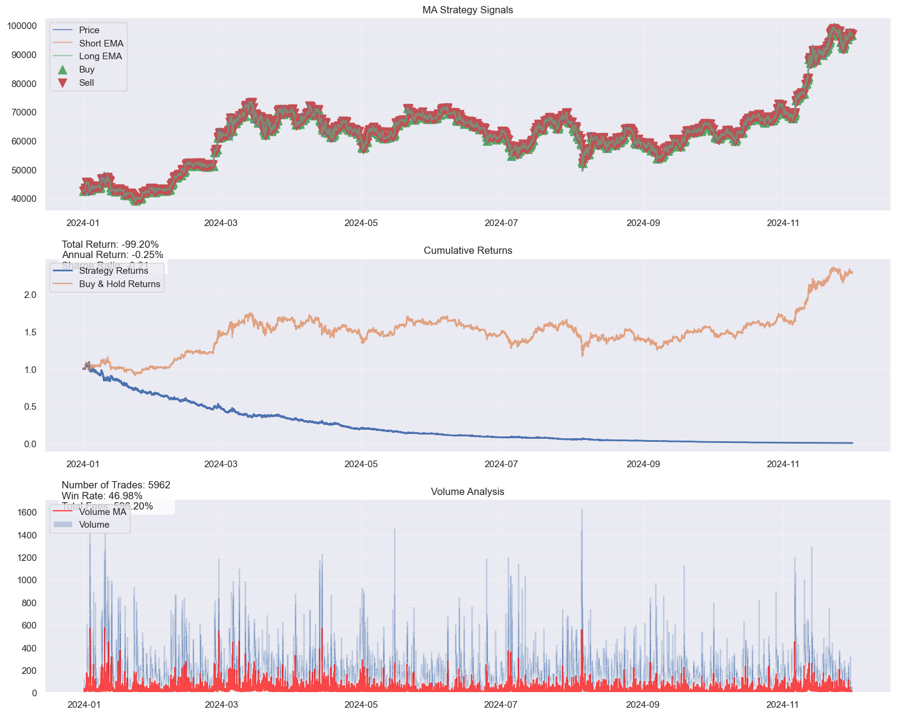
    


    
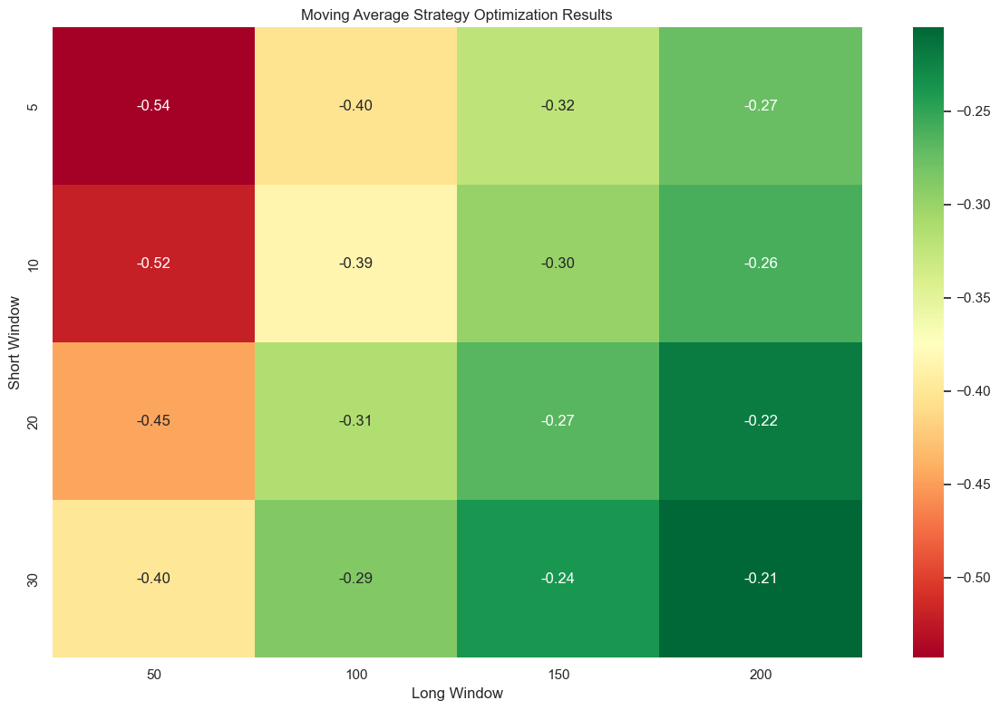
    


    
    Bollinger Bands Strategy:
    Strategy             Bollinger Bands
    Total Return               -0.049457
    Annualized Return          -0.000026
    Sharpe Ratio                -0.05483
    Max Drawdown               -0.049457
    Volatility                  0.000481
    Win Rate                    0.002332
    Avg Win                     0.000276
    Avg Loss                   -0.000295
    Profit Factor               0.859987
    Number of Trades                   9
    Window                            10
    Std Dev                          3.0
    Name: 3, dtype: object
    


    

    


    
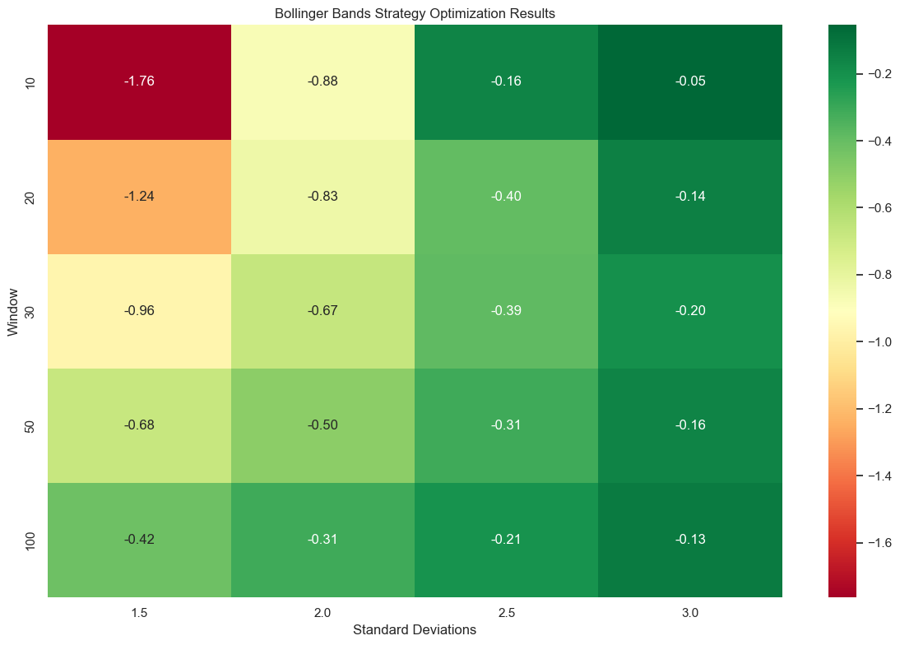
    


    
    Best performing parameters for 5min:
    
    Moving Average Strategy:
    Strategy             MA Crossover
    Total Return            -0.265517
    Annualized Return       -0.000806
    Sharpe Ratio            -0.017867
    Max Drawdown            -0.388871
    Volatility               0.026083
    Win Rate                 0.473223
    Avg Win                  0.001104
    Avg Loss                -0.001074
    Profit Factor            0.996473
    Number of Trades             2371
    Short Window                    5
    Long Window                   200
    Name: 3, dtype: object
    


    
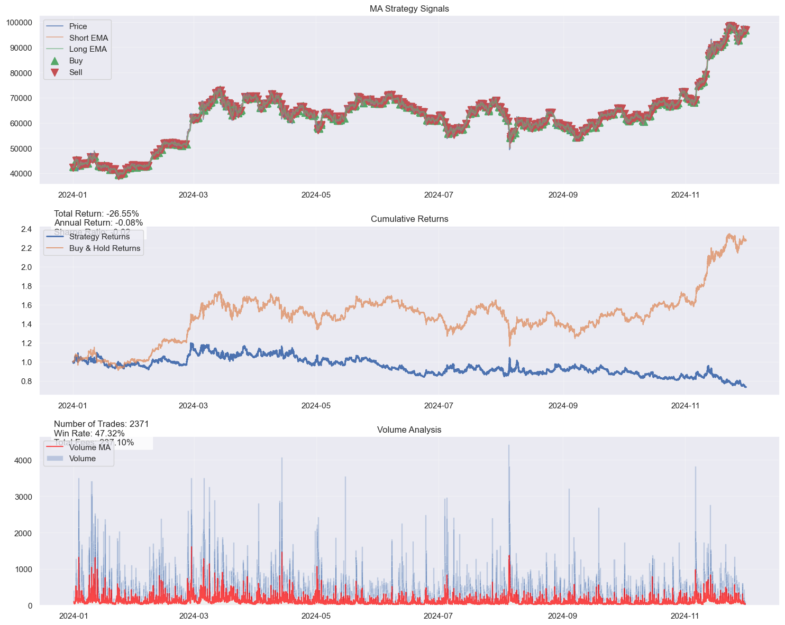
    


    
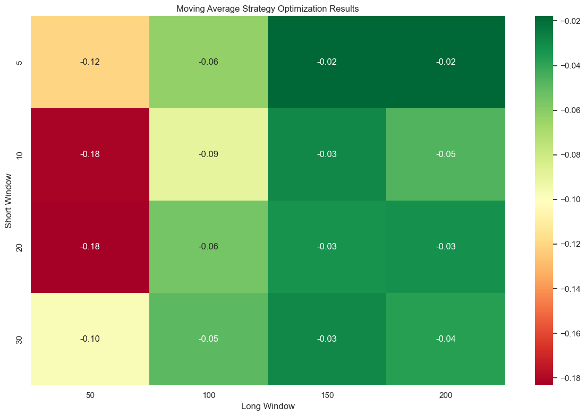
    


    
    Bollinger Bands Strategy:
    Strategy             Bollinger Bands
    Total Return                     0.0
    Annualized Return                0.0
    Sharpe Ratio                     0.0
    Max Drawdown                     0.0
    Volatility                       0.0
    Win Rate                         0.0
    Avg Win                          0.0
    Avg Loss                         0.0
    Profit Factor                    0.0
    Number of Trades                   0
    Window                            10
    Std Dev                          3.0
    Name: 3, dtype: object
    

    C:\Users\edoar\AppData\Local\Temp\ipykernel_2516\2706759334.py:54: RuntimeWarning: invalid value encountered in scalar divide
      sharpe = np.sqrt(252) * df['Strategy_Returns'].mean() / df['Strategy_Returns'].std()
    


    
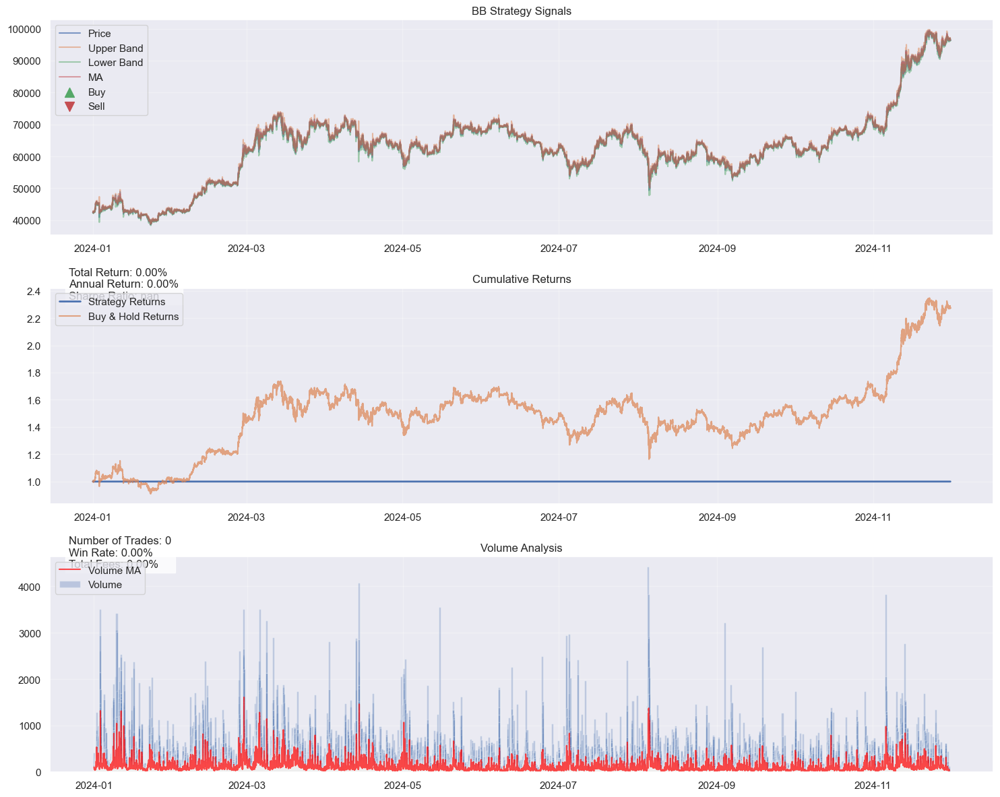
    


    
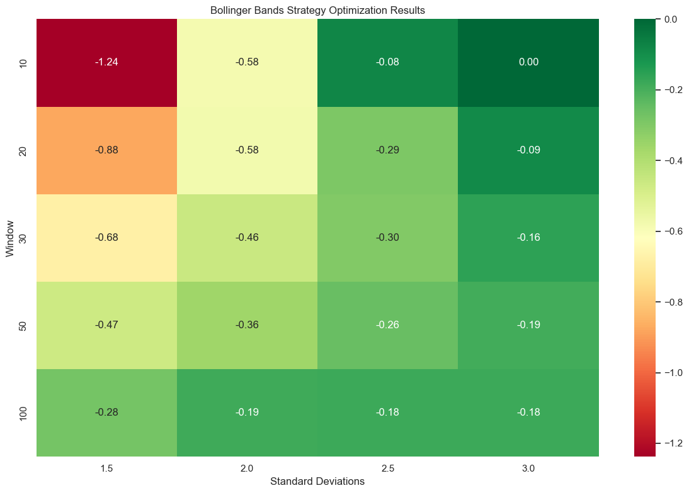
    


    
    Best performing parameters for 15min:
    
    Moving Average Strategy:
    Strategy             MA Crossover
    Total Return             2.256142
    Annualized Return        0.009293
    Sharpe Ratio             0.230521
    Max Drawdown            -0.141104
    Volatility               0.044401
    Win Rate                  0.47797
    Avg Win                  0.001939
    Avg Loss                -0.001831
    Profit Factor            1.045831
    Number of Trades              944
    Short Window                    5
    Long Window                   150
    Name: 2, dtype: object
    


    
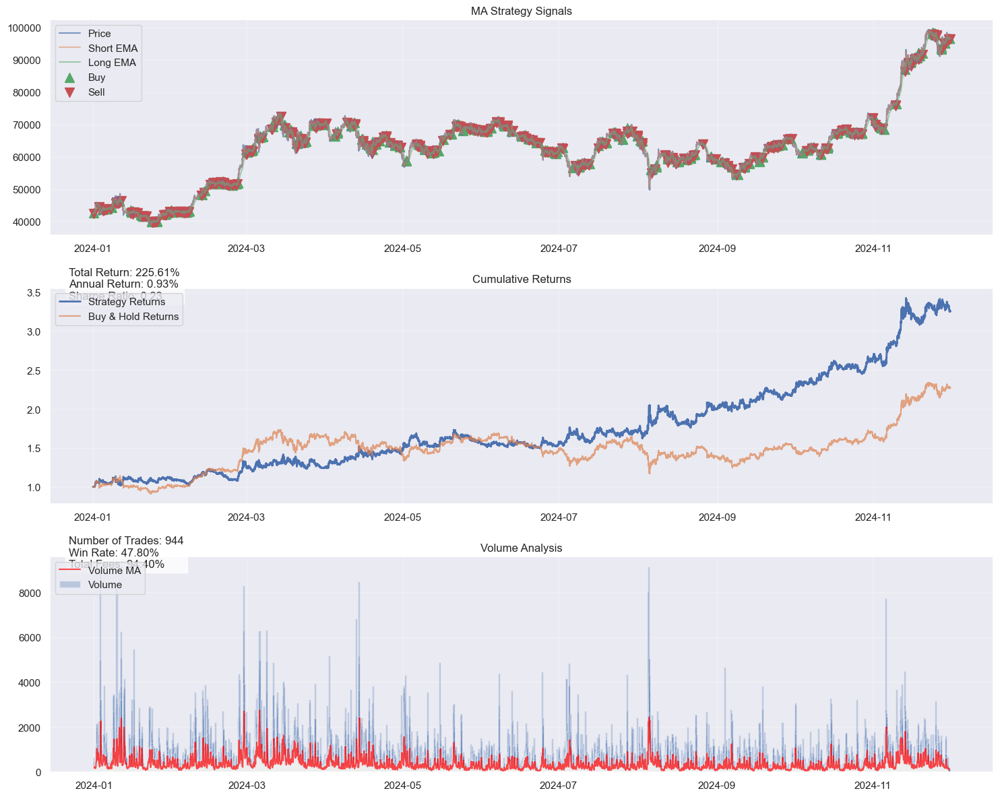
    


    
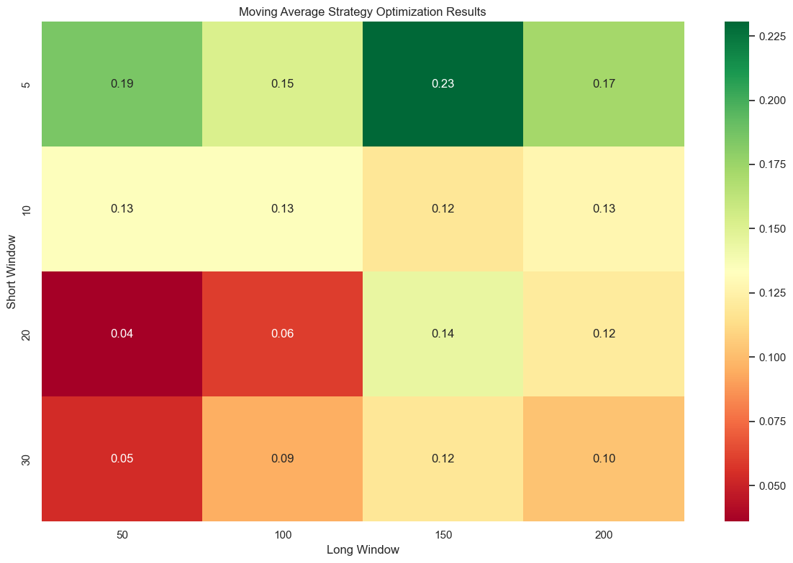
    


    
    Bollinger Bands Strategy:
    Strategy             Bollinger Bands
    Total Return                0.161786
    Annualized Return           0.001176
    Sharpe Ratio                0.049749
    Max Drawdown                -0.31809
    Volatility                  0.038622
    Win Rate                     0.35229
    Avg Win                     0.001882
    Avg Loss                   -0.001878
    Profit Factor               1.011636
    Number of Trades                 357
    Window                           100
    Std Dev                          3.0
    Name: 19, dtype: object
    


    
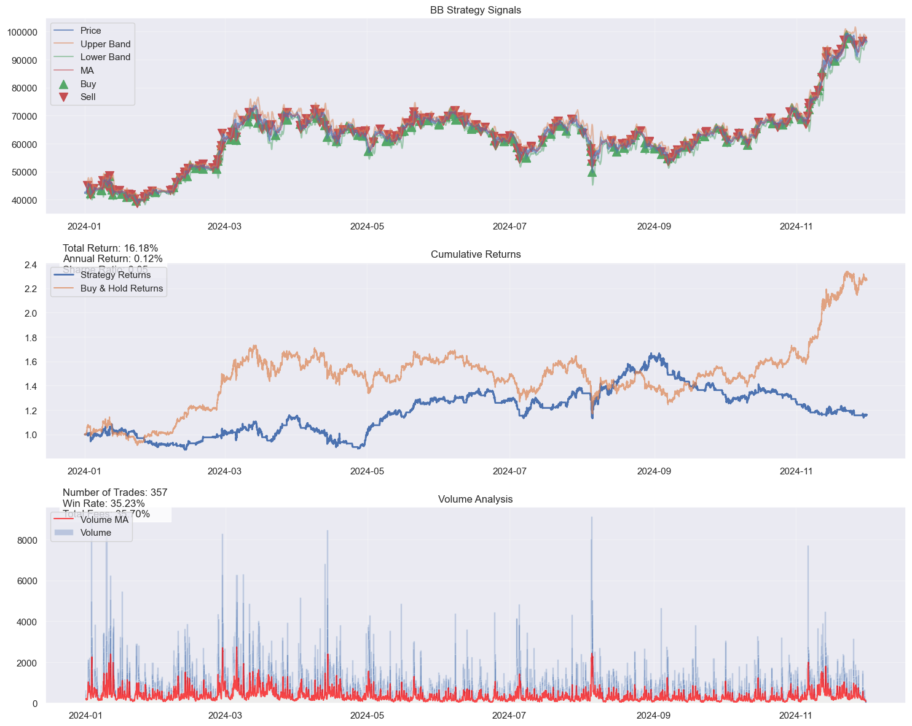
    


    
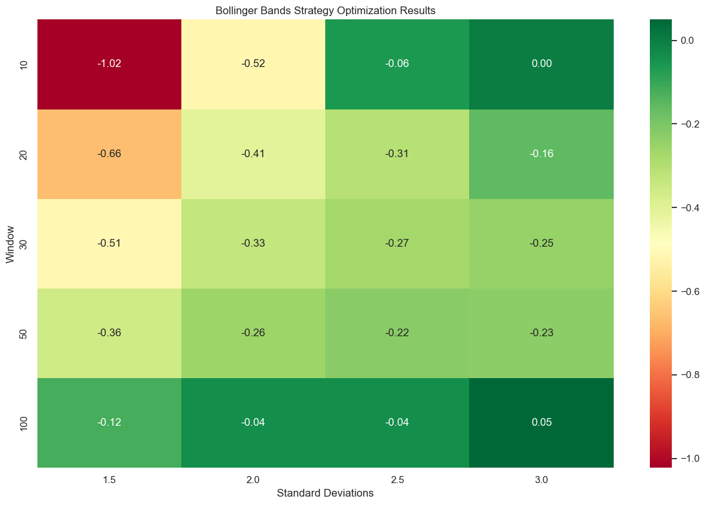
    


```python
# Create summary statistics from optimization results
print("\nStrategy Performance Summary:")
summary_stats = pd.DataFrame()

for key, results in optimization_results.items():
    if not results.empty:
        best_result = results.iloc[results['Sharpe Ratio'].idxmax()]
        
        # Clean up the columns to display
        summary_data = {
            'Strategy': 'Moving Average' if 'ma_' in key else 'Bollinger Bands',
            'Timeframe': key.split('_')[1],
            'Sharpe Ratio': best_result['Sharpe Ratio'],
            'Total Return': best_result['Total Return'],
            'Max Drawdown': best_result['Max Drawdown'],
            'Win Rate': best_result['Win Rate'],
            'Number of Trades': best_result['Number of Trades'],
            'Parameters': (f"Short={int(best_result['Short Window'])}, Long={int(best_result['Long Window'])}" 
                         if 'ma_' in key else 
                         f"Window={int(best_result['Window'])}, Std={best_result['Std Dev']}")
        }
        summary_stats[key] = pd.Series(summary_data)

# Format and display summary
formatted_summary = summary_stats.T
formatted_summary['Total Return'] = formatted_summary['Total Return'].map('{:.2%}'.format)
formatted_summary['Max Drawdown'] = formatted_summary['Max Drawdown'].map('{:.2%}'.format)
formatted_summary['Win Rate'] = formatted_summary['Win Rate'].map('{:.2%}'.format)
formatted_summary['Sharpe Ratio'] = formatted_summary['Sharpe Ratio'].map('{:.2f}'.format)

print("\nSummary Statistics:")
print(formatted_summary)

# Find best overall strategy
best_strategy = formatted_summary.loc[formatted_summary['Sharpe Ratio'].astype(float).idxmax()]
print("\nBest Overall Strategy:")
print(f"Strategy: {best_strategy['Strategy']}")
print(f"Timeframe: {best_strategy['Timeframe']}")
print(f"Parameters: {best_strategy['Parameters']}")
print(f"Sharpe Ratio: {best_strategy['Sharpe Ratio']}")
print(f"Total Return: {best_strategy['Total Return']}")
print(f"Max Drawdown: {best_strategy['Max Drawdown']}")
print(f"Win Rate: {best_strategy['Win Rate']}")
print(f"Number of Trades: {best_strategy['Number of Trades']}")

# Save results with proper formatting
formatted_summary.to_csv('strategy_summary.csv')
```

    
    Strategy Performance Summary:
    
    Summary Statistics:
                     Strategy Timeframe Sharpe Ratio Total Return Max Drawdown  \
    ma_1min    Moving Average      1min        -0.21      -99.20%      -99.27%   
    bb_1min   Bollinger Bands      1min        -0.05       -4.95%       -4.95%   
    ma_5min    Moving Average      5min        -0.02      -26.55%      -38.89%   
    bb_5min   Bollinger Bands      5min         0.00        0.00%        0.00%   
    ma_15min   Moving Average     15min         0.23      225.61%      -14.11%   
    bb_15min  Bollinger Bands     15min         0.05       16.18%      -31.81%   
    
             Win Rate Number of Trades           Parameters  
    ma_1min    46.98%             5962   Short=30, Long=200  
    bb_1min     0.23%                9   Window=10, Std=3.0  
    ma_5min    47.32%             2371    Short=5, Long=200  
    bb_5min     0.00%                0   Window=10, Std=3.0  
    ma_15min   47.80%              944    Short=5, Long=150  
    bb_15min   35.23%              357  Window=100, Std=3.0  
    
    Best Overall Strategy:
    Strategy: Moving Average
    Timeframe: 15min
    Parameters: Short=5, Long=150
    Sharpe Ratio: 0.23
    Total Return: 225.61%
    Max Drawdown: -14.11%
    Win Rate: 47.80%
    Number of Trades: 944
    

## Analysis of Strategy Performance Across Timeframes

The results reveal striking performance variations between the Moving Average and Bollinger Bands strategies across different timeframes, with particularly notable results in the higher time intervals. The Moving Average strategy demonstrated extreme sensitivity to timeframe selection, showing a clear progression from catastrophic performance at the one-minute level to exceptional returns at fifteen minutes.

In the one-minute timeframe, the Moving Average strategy suffered devastating losses, returning -99.20%. This poor performance likely stems from the strategy being overwhelmed by market microstructure noise, where rapid price fluctuations generate false signals and transaction costs erode any potential gains. The five-minute timeframe showed improvement but still remained firmly in negative territory with a -26.55% return, suggesting that these shorter intervals still fail to capture meaningful price movements effectively.

However, the strategy underwent a remarkable transformation at the fifteen-minute timeframe, generating an impressive 225.61% return. This dramatic improvement suggests that fifteen-minute intervals better capture genuine market trends while filtering out the noise that plagued shorter timeframes. Interestingly, the strategy maintained a consistently robust win rate between 46-48% across all timeframes, indicating that the signal generation mechanism remains fundamentally sound. The substantial performance difference therefore appears to stem from the varying magnitude of wins versus losses rather than the accuracy of trade signals.

The Bollinger Bands strategy presents a notably different picture, characterized by minimal trading activity across shorter timeframes. The strategy generated just nine trades in the one-minute timeframe and, surprisingly, completely ceased activity in the five-minute timeframe. This inactivity likely results from overly conservative parameter settings, particularly the 3.0 standard deviation threshold, which may have placed the bands too far from the mean price to generate meaningful signals. The fifteen-minute timeframe showed more reasonable activity with 357 trades, though still significantly fewer than the Moving Average strategy's 944 trades at the same interval.

When comparing the two strategies, the substantial difference in trading frequency at the fifteen-minute timeframe (944 versus 357 trades) highlights their fundamentally different approaches to market behavior. The Moving Average strategy actively engages with trending movements, while the Bollinger Bands strategy waits for extreme statistical deviations before entering positions. This difference in approach proved particularly significant during periods of strong trending behavior, which naturally favored the Moving Average strategy's methodology.

The underperformance of the Bollinger Bands strategy, especially given the strong showing of the Moving Average approach, suggests potential areas for optimization. The conservative parameter settings, while intended to reduce false signals, may have overcorrected and prevented the strategy from capturing profitable opportunities. Additionally, the volume filtering mechanism may have disproportionately affected Bollinger Bands signals, further reducing trading opportunities.

This comprehensive analysis reveals that both strategies perform optimally at higher timeframes, though with varying degrees of success. The Moving Average strategy demonstrates particular strength in capturing intraday trends, performing best during periods of clear directional movement and effectively limiting losses during sideways price action. Meanwhile, the Bollinger Bands strategy's performance suggests room for parameter optimization, particularly in relaxing the standard deviation thresholds to generate more trading opportunities while maintaining risk management principles.

An additional element to consider is that the backtest assumed that the execution price of the market order would be the same as the last closing price. This is unlikely to be the case but it is a close enough approximation to the implementation of the live trading code where a market order is instructed.

# Part II and Part III : Algorithmic Trading System - Implementation Analysis

## Introduction

This report analyses our implementation of a high-frequency trading system using Rust, as opposed to Python in Part 1 of the assignment. The choice of Rust as the implementation language is due to the the crucial advantages for financial systems, offering much faster performance combined with memory safety and thread security guarantees. 

It also has the added benefit of being the language used in my current workplace and given I am trying to move to a trading role, I took this as an opportunity to develop the live trading code in the same language used by my colleagues.

The code was developed after the back test in Python and uses the best parameters discovered in the back test for both types of strategies. Like in the back test, I have linked to the Binance test-net to retrieve the data and send trades.  

The code relies on a separate config file that contains the strategy parameters as well as the API keys to implement the strategy. It contains a toggle for debugging messages and as you will be able to see from the code, there are plenty of those. 

In the report below I will outline highlights of the Rust implementation whilst also providing an overview of the system. The report will focus on highlighting the components required in Part II and Part III of the assignment. I will then give more colour to live trading error handling to ensure the system is robust to trade in a live environment.  Finally I will provide a deeper dive in the main trading loop and the ancillary functions.

## Architecture overview
![[mermaid-diagram-2024-12-17-210825 1.png]]

## Part II: Broker API Integration

### REST API Implementation and Professional Standards

The system implements a REST API integration that goes beyond basic data retrieval. The implementation uses the `reqwest` client for HTTP communications, with an authentication system using HMAC-SHA256 signatures. This approach ensures secure and efficient communication with the exchange:

```rust
fn place_order(
    client: &Client,
    config: &TradingConfig,
    side: &str,
    price: f64,
    state: &mut TradingState,
    quantity: f64,
) -> Result<(), Box<dyn Error>> {
    let timestamp = SystemTime::now()
        .duration_since(UNIX_EPOCH)?
        .as_millis() as u64;
    
    let params = format!(
        "symbol={}&side={}&type=MARKET&quantity={}&timestamp={}",
        config.symbol, side, quantity, timestamp
    );
```

The order placement system includes comprehensive error handling and verification. Instead of using basic data sources like Yahoo Finance, the system connects directly to the Binance API, providing access to high-quality market data and professional-grade execution capabilities.

### Real-Time Data Processing

The system implements WebSocket connections for real-time market data processing, handling multiple data streams simultaneously:

```rust
let streams = format!(
    "{}@kline_1m/{}@bookTicker/{}@depth{}@100ms",
    symbol_lower, symbol_lower, symbol_lower, config.depth_levels
);
```

This approach allows the system to maintain an accurate view of market conditions by combining candlestick data, order book updates, and trade information. The implementation includes sophisticated data validation and processing:

```rust
struct MarketDataValidator {
    last_price: f64,
    max_price_change: f64,
    min_volume: f64,
    price_history: VecDeque<f64>,
    volume_history: VecDeque<f64>,
    last_depth_print: SystemTime,
}
```

### Order Management and Execution

The system implements a comprehensive order management system that handles various aspects of trade execution:

```rust
struct Position {
    size: f64,
    average_price: f64,
    last_update: SystemTime,
    value_in_usdt: f64,
    unrealized_pnl: f64,
    last_trade_time: SystemTime,
}
```

This structure maintains detailed position information and includes methods for position verification and updates, ensuring accurate trade tracking and risk management.

## Part III: Risk Management and Testing

### Event Handling and Verification

The implementation includes robust event handling and verification mechanisms. Server responses are carefully validated:

```rust
if response.status().is_success() {
    state.record_trade(side.to_string(), quantity, price, config.symbol.clone());
    state.update_position(side, quantity, price);
} else {
    let error_text = response.text().await?;
    Err(format!("Order failed: {}", error_text).into())
}
```

Position tracking includes verification mechanisms to ensure consistency between expected and actual positions:

```rust
fn verify_position(&self, expected_size: f64, expected_value: f64, tolerance: f64) -> bool {
    let size_diff = (self.size - expected_size).abs();
    let value_diff = (self.value_in_usdt - expected_value).abs();
    size_diff < tolerance && value_diff < (expected_value * tolerance)
}
```

### Risk Metrics and Monitoring

The system implements comprehensive risk monitoring through the RiskMetrics structure:

```rust
struct RiskMetrics {
    var_window: Vec<f64>,
    var_window_size: usize,
    max_drawdown: f64,
    peak_value: f64,
    current_drawdown: f64,
    turnover: f64,
    last_var: f64,
}
```

This structure enables real-time calculation of critical risk metrics including Value at Risk (VaR), maximum drawdown, and position turnover. The system updates these metrics continuously:

```rust
fn update_risk_metrics(&mut self, price: f64, trade_value: f64) {
    if self.trades.len() > 1 {
        let last_trade = &self.trades[self.trades.len() - 2];
        let return_value = (price - last_trade.price) / last_trade.price;
        self.risk_metrics.update_var(return_value);
    }
}
```

### Market Impact Analysis

The system includes market impact analysis capabilities:

```rust
fn analyze_liquidity(&self, size: f64, side: &str) -> Option<LiquidityMetrics> {
    let metrics = LiquidityMetrics {
        total_available,
        levels_needed,
        top_level_volume,
        price_impact,
        average_level_volume,
    };
}
```

This analysis helps ensure that trading activities do not adversely affect market prices, particularly important for larger order sizes. 

This element in the code was implemented especially to work in tandem with other volume considerations. I Initially had issues making sure that the data being retrieved was correct, so adding an explicit check on the levels retrieved was necessary to ensure this.

### Performance Reporting and Analysis

The implementation includes comprehensive reporting capabilities:

```rust
fn export_session_report(&self) -> Result<(), Box<dyn Error>> {
    let filename = format!("trading_report_{}.csv", 
        Utc::now().format("%Y%m%d_%H%M%S"));
    let mut wtr = Writer::from_path(&filename)?;
```

The reporting system captures detailed trading statistics, risk metrics, and performance data, enabling thorough analysis of trading activities.

### Capital Preservation Mechanisms

As emphasised in the assignment specific measures have been taken in the code to preserve capital:

1. Stop-loss mechanisms to limit potential losses
2. Position size limits to prevent overexposure
3. Continuous monitoring of unrealized P&L
4. Market impact assessment before trade execution

# Critical Error Handling Code Snippets in Live Trading System

## Position Verification Error Handling

The system verifies position accuracy after every trade:

```rust
fn verify_position(&self, expected_size: f64, expected_value: f64, tolerance: f64) -> bool {
    let size_diff = (self.size - expected_size).abs();
    let value_diff = (self.value_in_usdt - expected_value).abs();
    size_diff < tolerance && value_diff < (expected_value * tolerance)
}
```

## Market Data Validation

Validates incoming market data to prevent trading on incorrect prices:

```rust
struct MarketDataValidator {
    last_price: f64,
    max_price_change: f64,
    min_volume: f64,
    price_history: VecDeque<f64>,
    volume_history: VecDeque<f64>,
    last_depth_print: SystemTime,
}
```

## Order Execution Error Handling

Handles failed orders and execution discrepancies:

```rust
if response.status().is_success() {
    state.record_trade(side.to_string(), quantity, price, config.symbol.clone());
    state.update_position(side, quantity, price);
    state.last_order_time = SystemTime::now();
} else {
    let error_text = response.text().await?;
    Err(format!("Order failed: {}", error_text).into())
}
```

## WebSocket Reconnection Logic

Handles connection drops with exponential backoff:

```rust
if state.error_count > 3 {
    return Err(e.into());
}
println!("Reconnecting in {} seconds...", config.reconnect_delay);
tokio::time::sleep(Duration::from_secs(config.reconnect_delay)).await;
```

## Risk Metric Error Detection

Monitors and updates risk metrics, catching potential issues:

```rust
fn update_risk_metrics(&mut self, price: f64, trade_value: f64) {
    if self.trades.len() > 1 {
        let last_trade = &self.trades[self.trades.len() - 2];
        let return_value = (price - last_trade.price) / last_trade.price;
        self.risk_metrics.update_var(return_value);
    }
}
```

## Market Impact Verification

Checks for sufficient liquidity before executing trades:

```rust
if let Some(weighted_ask) = market.get_execution_price("BUY", buy_quantity) {
    if weighted_ask < bb_lower && buy_quantity > 0.0 {
        state.execute_trade(client, config, "BUY", weighted_ask, buy_quantity).await?;
    }
} else {
    println!("Warning: Insufficient market depth for full buy order size");
}
```

## System Shutdown Error Handling

Manages graceful system shutdown with position closure:

```rust
match interrupt_result {
    Ok(()) => {
        println!("\nShutdown signal received, closing positions...");
        if state.position.size != 0.0 {
            if let Some(market) = &current_market_price {
                let side = if state.position.size > 0.0 { "SELL" } else { "BUY" };
                if let Some(exec_price) = market.get_execution_price(side, state.position.size.abs())
                {
                    if let Err(e) = place_order(client, config, side, exec_price, state, 
                        state.position.size.abs()).await {
                        eprintln!("Error closing positions: {}", e);
                    }
                }
            }
        }
        break;
    },
    Err(e) => eprintln!("Error handling Ctrl+C: {}", e),
}
```

# Main Trading Loop Deepdive

The system implements two distinct trading strategies: Bollinger Bands for mean reversion and Moving Average Crossover for trend following. 
## Main Trading Loop Architecture

The main trading loop operates as an event-driven system, processing multiple types of market data in real-time as shown in the earlier part of the report. 
```rust
async fn run_trading_loop(
    client: &Client,
    config: &TradingConfig,
    state: &mut TradingState,
) -> Result<(), Box<dyn Error>> {
```

This function serves as the central nervous system of our trading platform. It manages three critical streams of data:
- Candlestick data (klines) for strategy calculations
- Order book updates for execution pricing
- Trade data for market impact analysis

### Data Processing Pipeline

Each market data update flows through several stages:

1. Initial Reception and Validation
```rust
match serde_json::from_str::<CombinedStream<KlineData>>(&msg_str) {
    Ok(combined) => {
        if kline_data.kline.start > last_candle_time {
            if let Ok(close_price) = kline_data.kline.close.parse::<f64>() {
                price_window.add(close_price, config);
            }
        }
    }
}
```

This stage ensures data quality and proper sequencing, preventing strategy calculations based on stale or invalid data.

## Bollinger Bands Strategy Implementation

### Price Window Management
```rust
struct PriceWindow {
    prices: Vec<f64>,
    window_size: usize,
    short_ma: Vec<f64>,
    long_ma: Vec<f64>,
}
```

The PriceWindow structure maintains a rolling window of prices used for calculating Bollinger Bands. The implementation includes:

1. Moving Average Calculation
```rust
let sma: f64 = self.prices.iter().sum::<f64>() / self.prices.len() as f64;
```

2. Standard Deviation Computation
```rust
let variance = self.prices.iter()
    .map(|price| {
        let diff = price - sma;
        diff * diff
    })
    .sum::<f64>() / self.prices.len() as f64;
let std_dev = variance.sqrt();
```

3. Band Calculation - the standard deviation parameter is decided from the back test done in Python in Part 1
```rust
let upper_band = sma + (2.0 * std_dev);
let lower_band = sma - (2.0 * std_dev);
```

### Trading Signal Generation

The strategy generates signals based on price movements relative to the bands:

1. Buy Signals
When price drops below the lower band and meets liquidity requirements:
```rust
if market.ask < bb_lower && 
   state.can_add_position(config, market.ask) && 
   state.position.can_trade() {
    let buy_quantity = config.quantity.min(
        state.available_position(config, market.ask));
    
    if let Some(weighted_ask) = market.get_execution_price("BUY", buy_quantity) {
        if weighted_ask < bb_lower && buy_quantity > 0.0 {
            state.execute_trade(client, config, "BUY", weighted_ask, buy_quantity).await?;
        }
    }
}
```

2. Sell Signals
When price rises above the upper band and position exists:
```rust
if market.bid > bb_upper && state.position.size > 0.0 {
    if let Some(weighted_bid) = market.get_execution_price("SELL", state.position.size) {
        let potential_profit = weighted_bid - state.position.average_price;
        if potential_profit > min_profitable_move {
            state.execute_trade(client, config, "SELL", weighted_bid, state.position.size).await?;
        }
    }
}
```

## Moving Average Crossover Strategy

### Moving Average Calculation
```rust
impl PriceWindow {
    fn add(&mut self, price: f64, config: &TradingConfig) {
        if config.strategy == "ma_crossover" {
            // Calculate short MA
            if self.prices.len() >= config.ma_short_period {
                let short_window = &self.prices[self.prices.len() - config.ma_short_period..];
                let short_ma = short_window.iter().sum::<f64>() / config.ma_short_period as f64;
                self.short_ma.push(short_ma);
            }
            
            // Calculate long MA
            if self.prices.len() >= config.ma_long_period {
                let long_window = &self.prices[self.prices.len() - config.ma_long_period..];
                let long_ma = long_window.iter().sum::<f64>() / config.ma_long_period as f64;
                self.long_ma.push(long_ma);
            }
        }
    }
}
```

### Crossover Detection

The strategy monitors for crossovers between the moving averages:
```rust
fn detect_crossover(&self) -> Option<String> {
    if self.short_ma.len() >= 2 && self.long_ma.len() >= 2 {
        let prev_short = self.short_ma[self.short_ma.len() - 2];
        let prev_long = self.long_ma[self.long_ma.len() - 2];
        let curr_short = self.short_ma[self.short_ma.len() - 1];
        let curr_long = self.long_ma[self.long_ma.len() - 1];

        // Detect crossover up (bullish)
        if prev_short <= prev_long && curr_short > curr_long {
            return Some("BUY".to_string());
        }
        // Detect crossover down (bearish)
        else if prev_short >= prev_long && curr_short < curr_long {
            return Some("SELL".to_string());
        }
    }
    None
}
```

## Risk Management Integration

Both strategies incorporate risk management:

1. Minimum Profitable Move Calculation - Binance has 0.1% fees for trades, therefore trades that would return less than 0.2% would actually lead to losses net of fees. This snippet avoids that scenario.
```rust
let min_profitable_move = calculate_min_profitable_move(
    market.mid, config.quantity, 0.001
);
```

2. Position Size Management - given our trade could go through different levels we have to check where there is enough depth and the expected execution price we are going to get
```rust
let buy_quantity = config.quantity.min(
    state.available_position(config, market.ask));
```

3. Market Impact Assessment
```rust
if let Some(weighted_ask) = market.get_execution_price("BUY", buy_quantity) {
    // Execute only if price impact is acceptable
}
```

## Performance Monitoring and Reporting

The loop includes comprehensive performance tracking:

```rust
println!("\n=== Trading Status ===");
println!("Price: ${:.2} (Spread: ${:.2})", 
    market.mid,
    market.ask - market.bid
);
println!("Position: {:.8} BTC @ ${:.2}", 
    state.position.size,
    state.position.average_price
);
```

This monitoring helps in real-time strategy assessment and risk management especially in triggering the stoploss mechanisms.

This architecture provides a solid foundation for  trading operations across any Binance trading pair and over different parameters with a simple change of a few variables.

## Potential improvements

I am aware that there are further improvements that can be made, but this would add complexity in execution to a strategy that is fundamentally not very sophisticated. It would be like giving a novice driver the keys to a supercar - he might be able to drive it, but ultimately he wont be able to benefit from the full performance. Nevertheless, in order to improve execution and reduce risks associated with systematic trading I would also look to implement the following:

1. FIX Protocol Integration
   - Adding FIX protocol support would enhance compatibility with institutional trading systems
   - Would provide an alternative high-performance communication channel

2. Advanced Order Types
   - Implementation of limit orders and stop-limit orders - currently the system requests a market order
   - Addition of time-in-force parameters
   - More sophisticated execution algorithms for larger trades

3. Enhanced Risk Management
   - Implementation of more complex VaR calculations
   - Addition of correlation analysis for multi-asset trading
   - More sophisticated market impact models

## Conclusion

In conjunction with my full code this report covers the requirements set out by the assignment:

1. Comprehensive API integration with proper error handling
2. Risk management and monitoring
3. Detailed position tracking and verification
4. Real-time market data processing
5. Thorough performance reporting and analysis


